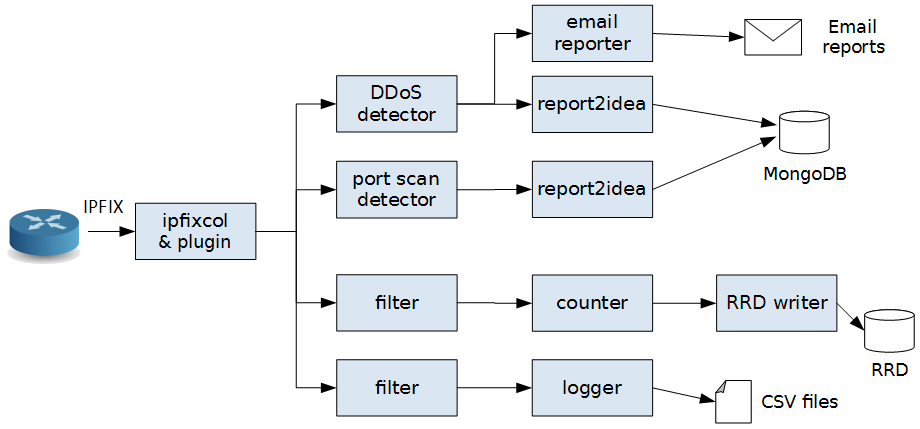
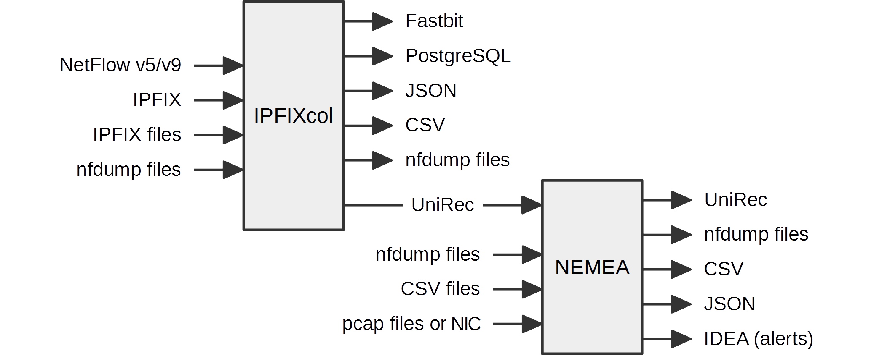

# General Information

NEMEA (Network Measurements Analysis) system is a **stream-wise**,
**flow-based** and **modular** detection system for network traffic analysis.
In practice, it is a set of independently running NEMEA modules that process
continuously incoming data (**messages**). Usually, the messages contain information about network
flows (like NetFlow or IPFIX formats) but the messages are more general - they might represent
detected security events or anything else.
A NEMEA module is technically an executable file that can be run in multiple instances in
an operating system.  

The system is suitable for an on-the-fly analysis of the flow data (live or captured&stored).
The system currently contains a set of modules for *detection* various types of suspicious traffic,
computing *statistics* of the traffic, *filtering*/*aggregating* messages,
*reporting* alerts that were detected.
Even though the functionality of modules differ (each module has some own purpose), all modules
are handled uniformly - they all use the same **NEMEA framework** that implements the functionality
of inter-module communication, data format (representation of the messages), common data structures
and algorithms.

**NEMEA Modules** can receive or send messages using input and output **communication
interfaces (IFC)**.  The number of input and output IFCs is usually chosen by a developer
based on the functionality of the NEMEA module, e.g. a detection module usually receives
flow data via one input IFC and sends alerts (other format/content of messages)
via one output IFC.



Since the **configuration of IFCs** is done during **startup**, a user may choose which module to interconnect
and how.  There are several types of IFCs that can be chosen ([IFC types](/trap-ifcspec/)).
A NEMEA module (at the time of development) does not need any information about other modules,
however, it usually expects some information fields in the messages that are needed for the processing.
That means a module might be connected to any other module to receive data from, but
only a data sources containing all needed information will work.

There are several ways how to **get data into NEMEA**. It is possible to read data from *files*
(CSV, nfdump, PCAP), receive data from [IPFIXcol collector](https://github.com/CESNET/IPFIXcol)
(which supports NetFlow/IPFIX formats) via special IPFIXcol [UniRec plugin](https://github.com/CESNET/ipfixcol/tree/master/plugins/storage/unirec), use NEMEA flow exporter ([flow_meter](https://github.com/CESNET/Nemea-Modules/tree/master/flow_meter)).




Further Information
===================

* [Documentation section](/doc/)
* README files of [NEMEA](https://github.com/CESNET/NEMEA/), [Modules](https://github.com/CESNET/Nemea-Modules/), [Detectors](https://github.com/CESNET/Nemea-Detectors/), [NEMEA Supervisor](https://github.com/CESNET/Nemea-Supervisor/)
* Public mailing list: nemea@cesnet.cz, subscribe at: [https://random.cesnet.cz/mailman/listinfo/nemea](https://random.cesnet.cz/mailman/listinfo/nemea)
* The archive of mailing list: [https://random.cesnet.cz/pipermail/nemea/](https://random.cesnet.cz/pipermail/nemea/)
* Twitter: [@NEMEA_System](https://twitter.com/NEMEA_System)

Attribution
===========

We kindly ask anyone who uses NEMEA for research and writes an academic paper about it to cite NEMEA as follows:

```
@inproceedings{nemea16,
    author = {Cejka, Tomas and Bartos, Vaclav and Svepes, Marek and Rosa, Zdenek and Kubatova, Hana},
    title = {NEMEA: A Framework for Network Traffic Analysis},
    booktitle = {12th International Conference on Network and Service Management (CNSM 2016)},
    doi = {10.1109/CNSM.2016.7818417},
    url = {http://dx.doi.org/10.1109/CNSM.2016.7818417},
    year = 2016
}
```

NEMEA Related Publications
==========================

* Tomas Jansky, Tomas Cejka, Vaclav Bartoš, [Hunting SIP Authentication Attacks Efficiently](http://dx.doi.org/10.1007/978-3-319-60774-0_9), In Security of Networks and Services in an All-Connected World: 11th IFIP WG 6.6 International Conference on Autonomous Infrastructure, Management, and Security, AIMS 2017, Zurich, Switzerland, 2017.

* Marek Švepeš, Tomas Cejka. [Making Flow-Based Security Detection Parallel](http://dx.doi.org/10.1007/978-3-319-60774-0_1). In Security of Networks and Services in an All-Connected World: 11th IFIP WG 6.6 International Conference on Autonomous Infrastructure, Management, and Security, AIMS 2017, Zurich, Switzerland, 2017.

* Tomas Cejka, Václav Bartoš, Marek Svepes, Zdenek Rosa, Hana Kubatova. [NEMEA: A Framework for Network Traffic Analysis](http://dx.doi.org/10.1109/CNSM.2016.7818417). In 12th International Conference on Network and Service Management (CNSM 2016), Montreal, Canada, 2016.

* Zdenek Rosa, Tomas Cejka, Martin Zadnik, Viktor Puš. [Building a Feedback Loop to Capture Evidence of Network Incidents](http://dx.doi.org/10.1109/CNSM.2016.7818435). In 12th International Conference on Network and Service Management (CNSM 2016), Montreal, Canada, 2016.

* Tomas Cejka, Marek Svepes. [Analysis of Vertical Scans Discovered by Naive Detection](http://dx.doi.org/10.1007/978-3-319-39814-3_19). Management and Security in the Age of Hyperconnectivity: 10th IFIP WG 6.6 International Conference on Autonomous Infrastructure, Management, and Security, AIMS 2016.

* Tomáš Čejka, Radoslav Bodó, Hana Kubátová: Nemea: Searching for Botnet Footprints. In: Proceedings of the 3rd Prague Embedded Systems Workshop (PESW), Prague, CZ, 2015.

* Tomáš Čejka, Václav Bartoš, Lukáš Truxa, Hana Kubátová: [Using Application-Aware Flow Monitoring for SIP Fraud Detection](http://link.springer.com/chapter/10.1007/978-3-319-20034-7_10). In: Proc. of 9th International Conference on Autonomous Infrastructure, Management and Security (AIMS15), 2015.

* Tomáš Čejka, Zdeněk Rosa and Hana Kubátová: [Stream-wise Detection of Surreptitious Traffic over DNS](http://ieeexplore.ieee.org/xpl/articleDetails.jsp?reload=true&arnumber=7033254). In: Proc. of 19th IEEE International Workshop on Computer Aided Modeling and Design of Communication Links and Networks (CAMAD 2014). Athens, 2014.

* Václav Bartoš, Martin Žádník, Tomáš Čejka: [Nemea: Framework for stream-wise analysis of network traffic](http://www.cesnet.cz/wp-content/uploads/2014/02/trapnemea.pdf), CESNET technical report 6/2013.

